# Mixed-Reality Digital Twins for Hybrid Sim2Real Transfer of Multi-Agent Reinforcement Learning Policies

| 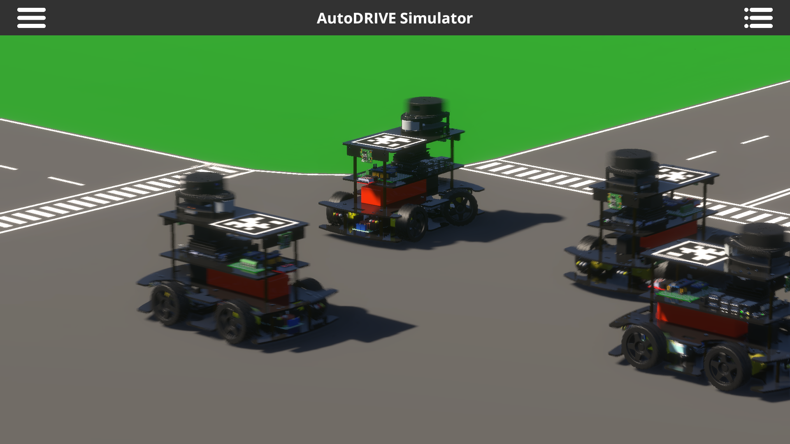 | 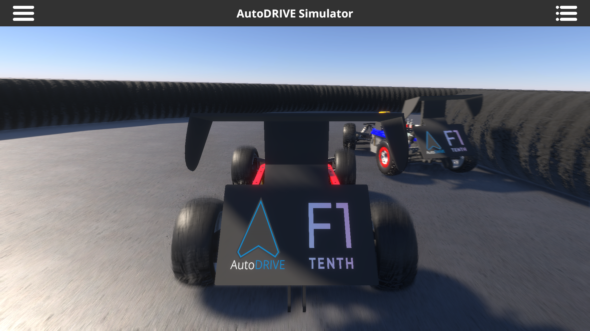 |
|:--------------------:|:--------------------:|
| **Cooperative MARL** | **Competitive MARL** |

**Abstract:** This work presents a modular and parallelizable multi-agent deep reinforcement learning framework capable of scaling the parallelized workloads on-demand. We first introduce AutoDRIVE Ecosystem as an enabler to develop physically accurate and graphically realistic digital twins of Nigel and F1TENTH, two scaled autonomous vehicle platforms with unique qualities and capabilities, and leverage this ecosystem to train and deploy cooperative as well as competitive multi-agent reinforcement learning policies. We first investigate an intersection traversal problem using a set of 4 cooperative vehicles (Nigel) that share limited state information with each other in single as well as multi-agent learning settings using a common policy approach. We then investigate an adversarial head-to-head autonomous racing problem using a set of 2 vehicles (F1TENTH) in a multi-agent learning setting using an individual policy approach. In either set of experiments, a decentralized learning architecture was adopted, which allowed robust training and testing of the approaches in stochastic environments, since the agents were mutually independent and exhibited asynchronous motion behavior. The problems were further aggravated by providing the agents with sparse observation spaces and requiring them to sample control commands that implicitly satisfied the imposed kinodynamic as well as safety constraints. The experimental results for both problem statements are reported in terms of quantitative metrics and qualitative remarks for training as well as deployment phases. Additionally, we discuss agent/environment parallelization techniques adopted to efficiently accelerate the MARL training in either case-studies.

## DIGITAL TWINS

|  |  |  |  |
|:------------------:|:-----------------:|:--------------------:|:-------------------:|
| **Physical Nigel** | **Virtual Nigel** | **Physical F1TENTH** | **Virtual F1TENTH** |

We leveraged [AutoDRIVE Simulator](https://github.com/Tinker-Twins/AutoDRIVE/tree/AutoDRIVE-Simulator) to develop physically and graphically realistic digital twin models of [Nigel](https://autodrive-ecosystem.github.io) as well as [F1TENTH](https://f1tenth.org), two scaled autonomous vehicle platforms with unique qualities and capabilities. This process involved modeling, calibrating and simulating physically accurate vehicle dynamics, physics-based sensors and actuators as well as environment physics, while equally weighing the lighting and rendering aspects for photorealistic visual fidelity. The focus of this process was to train sim2real-worthy RL policies by bridging the gap between simulation and reality.

|  |  |
|:----------------------:|:------------------------:|
| **Nigel Digital Twin** | **F1TENTH Digital Twin** |

From MARL perspective, the said simulation framework was developed modularly using object-oriented programming (OOP) constructs. This allowed selectively scaling up/down the parallel agent/environment instances on demand. Additionally, the simulator took advantage of CPU multi-threading as well as GPU instancing (if available) to efficiently parallelize various simulation objects and processes, with cross-platform support.

## LEARNING ARCHITECTURES

| 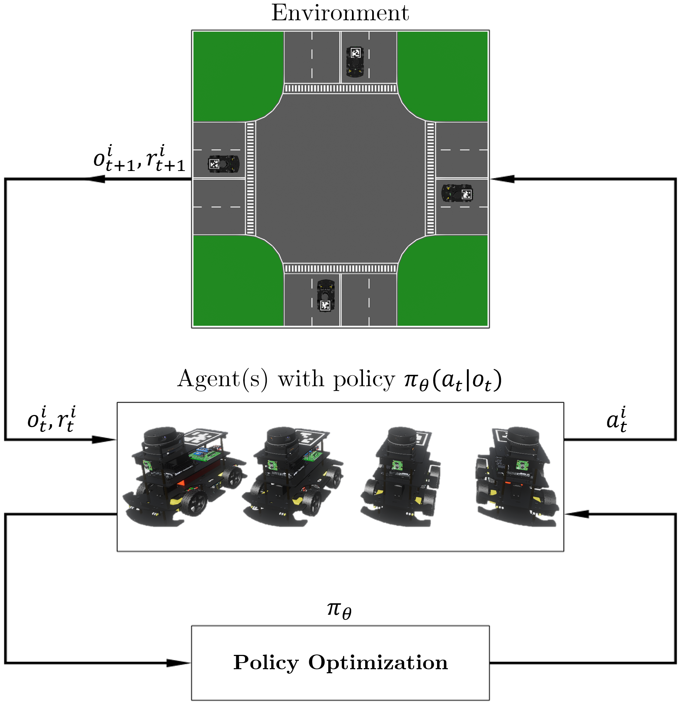 |  |
|:-----------------------------------------------------------------:|:--------------------------------------------------------------:|
| **Deep Reinforcement Learning Architecture for Cooperative MARL** | **Demonstration-Guided DRL Architecture for Competitive MARL** |

We formulated the cooperative MARL problem as a partially observable Markov decision process (POMDP) with limited state sharing among the agents via V2V communication. We adopted a deep reinforcement learning (DRL) architecture and crafted a novel reward function to train the agent(s) to traverse the 4-way intersection safely.

The competitive MARL problem was also formulated as a partially observable Markov decision process (POMDP), but without any state sharing among the agents. We adopted a hybrid imitation-reinforcement learning architecture and crafted a novel reward function to train a deep neural network policy to drive (using imitation learning) and race (using reinforcement learning) autonomously.

## TRAINING RESULTS

|  |  | 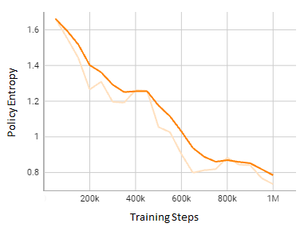 |
|:-----------------------------------------------------:|:-----------------------------------------------------:|:-----------------------------------------------------:|
|  | 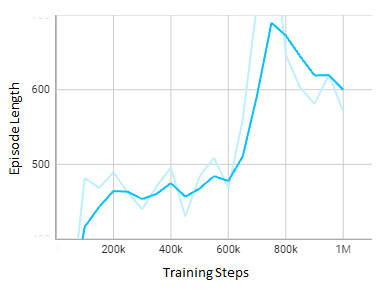 |  |

We analyzed the training for both single-agent (first row) as well as multi-agent (second row) systems learning the intersection traversal task. The key training metrics being analyzed here were the cumulative reward, episode length and policy entropy. A general indication of “good” training is that the cumulative reward is maximized and then saturated, the episode length is adequate (longer duration implies agents wandering off in the environment, while very short duration may be indicative of agents colliding/overstepping lane bounds), and the policy entropy (i.e., randomness) has decreased steadily as the training progressed. It is to be noted that the predominant cause for the difference in trends of training metrics for single and multi-agent scenarios is the higher stochasticity of the multi-agent scenario, which is especially evident from the policy entropy.

|  | 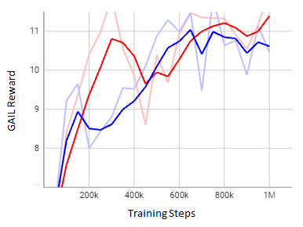 |  |
|:-----------------------------------------------------:|:-----------------------------------------------------:|:-----------------------------------------------------:|
| 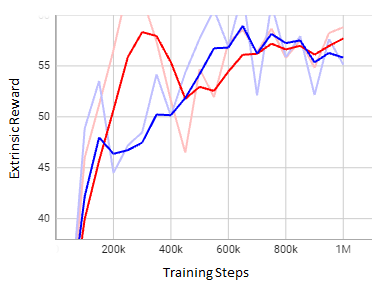 |  |  |

For competitive MARL, the training phase of the proposed approach was analyzed in order to gain a better insight into the policy optimization process, and comment on the effectiveness of the hybrid learning strategy adopted therein. Particularly, we analyzed the imitation learning (behavioral cloning loss, GAIL reward) and reinforcement learning (curiosity reward, extrinsic reward) metrics along with the episode length and policy entropy.  A general indication of “good” training is that the behavioral cloning loss has decayed smoothly, the GAIL, curiosity and extrinsic rewards are maximized and then saturated, the episode length is adequate (longer duration implies agents driving slowly, while very short duration may be indicative of agents colliding without lap completion), and the policy entropy (i.e., randomness) has decreased steadily as the training progressed. It is to be noted that the non-zero offset in behavioral cloning loss indicates that the agents have not over-fit to the demonstrations; rather, they have explored the state space quite well to maximize the extrinsic reward by adopting aggressive “racing” behaviors.

## SIMULATION PARALLELIZATION

|  | 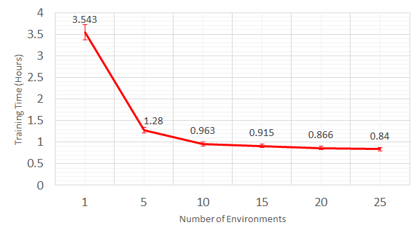 | 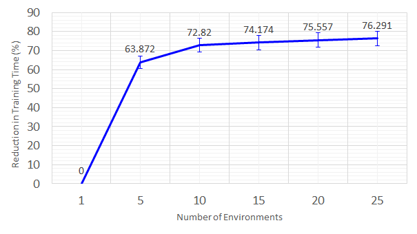 |
|:-----------------------------------------------------:|:-----------------------------------------------------:|:-----------------------------------------------------:|
|  | 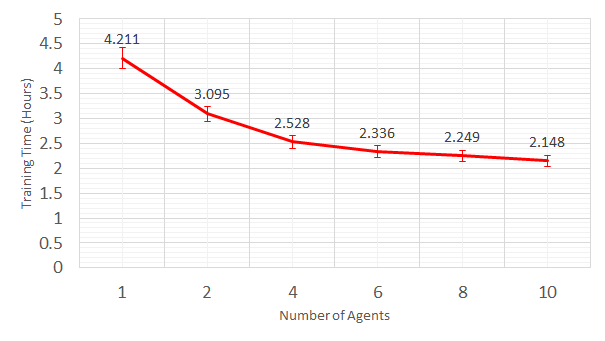 | 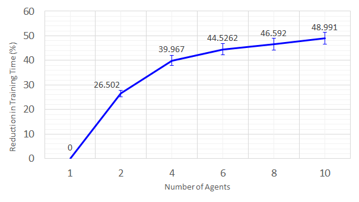 |

We analyzed the effect of agent/environment parallelization on training MARL behaviors.
- **Environment Parallelization:** Isolated agents can learn the same task in parallel environments. This method can come in handy to train single/multiple agents in different environmental conditions, with slight variation in each environment.
- **Agent Parallelization:** Parallel agents can learn the same task in the same environment. In a multi-agent setting, these parallel agents will collide/percieve/interact only with their true peers/opponents. Additionally, these parallel agents may/may not be exactly identical, thereby robustifying them against minor parametric variations.

Particularly, we adopted environment parallelization (1 to 25 parallel environments, with 4 agents each) for cooperative MARL and agent parallelization (1x2 to 10x2 adversarial agents) for competitive MARL.

As observed in both the rows, the reduction in training time was quite non-linear since the simulation workload increased with increasing parallelization. As a result, we can notice the curves nearly saturate after a point, which is subject to change with a different hardware/software configuration. Additionally, it should be noted that parallelization beyond a certain point can hurt, wherein the increased simulation workload may slow down the training so much that parallel policy optimization can no longer accelerate it.

## DEPLOYMENT RESULTS

| 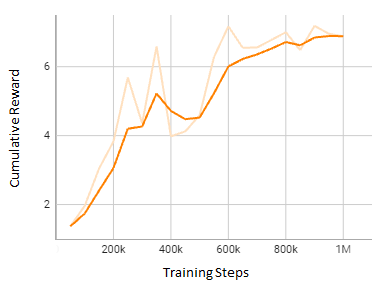 |  |  |
|:-----------------------------------------------------:|:-----------------------------------------------------:|:-----------------------------------------------------:|
|  |  |  |

The trained policies for cooperative MARL were deployed onto the simulated vehicles, separately for both single-agent and multi-agent scenarios. Figures in the first row present three key stages of the single-agent intersection traversal scenario. The first stage depicts the ego vehicle approaching the conflict zone, where it could potentially collide with peer vehicles. The second stage shows the vehicle executing a left turn to avoid collisions. Finally, the third stage illustrates the vehicle performing a subtle right turn to reach its goal. Figures in the second row display three critical stages of the multi-agent intersection traversal scenario. In the first frame, vehicles 1 and 4 successfully avoid collision. The second frame showcases vehicle 1 finding a gap between vehicles 2 and 3 to reach its goal. In the third frame, vehicles 2 and 3 evade collision, while vehicle 4 approaches its goal, and vehicle 1 is re-spawned.

|  | 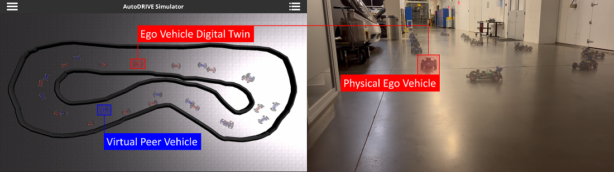 |  |
|:------------------------------------------------------:|:------------------------------------------------------:|:------------------------------------------------------:|
|  |  |  |

The trained policies for competitive MARL were deployed onto the respective simulated vehicles, which were made to race head-to-head on the same track with a phase-shifted initialization (as in real F1TENTH competitions).
Apart from completing several laps, we noticed some clever strategies that the agents had learned to block/overtake their opponent. Figures in the first row present three snapshots of a block-block-overtake sequence, wherein the red agent kept blocking the blue agent throughout the straight, but the blue agent took a wider turn with higher velocity and took advantage of its under-steer characteristic to cut in front of the red agent and overtake it. Figures in the second row display three snapshots of a let-pass-and-overtake sequence, wherein the blue agent found a gap between the red agent and inside edge of the track and opportunistically overtook it. However, due to its under-steering characteristic, it went wider in the corner, thereby allowing the red agent to overtake it and re-claim the leading position.

| 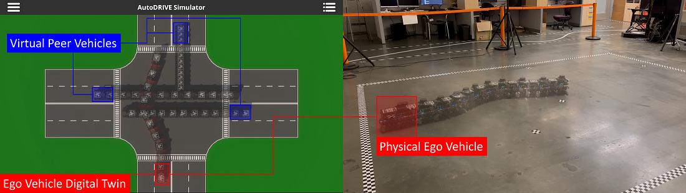 |
|:------------------------------------------------------:|
|  |

After extensive simulation-based verification of the trained policies, they were transferred onto a physical vehicle (so as to exploit the real-world characteristics of the vehicle
dynamics and tire-road interconnect), which was embedded within a true digital twin framework as depicted above (captured at 1 Hz). Particularly, a single physical vehicle was deployed in the loop with multiple virtual peer vehicles, which collectively embodied the multi-agent system. This method of augmenting the environmental elements and peer agents in the digital space was established for being resource-altruistic. This experiment validated the sim2real transferability of the trained MARL policies, without over-utilizing the hardware resources. It is worth mentioning that the digital twin framework supports incrementally deploying multiple vehicles in the real world based on the hardware resources at the disposal. Such incremental digital twin deployments can also ensure minimal physical damage, especially while deploying nascent MARL algorithms.

## SETUP

1. [Download](https://unity.com/download) and [install](https://docs.unity3d.com/hub/manual/InstallHub.html) Unity Hub along with Unity 2021.3.9f1 (LTS) or higher.

2. Install AutoDRIVE Simulator (from source):
     
    - Clone the Clone `AutoDRIVE-Simulator` branch of the `AutoDRIVE` repository:
    
      ```bash
      $ git clone --single-branch --branch AutoDRIVE-Simulator https://github.com/Tinker-Twins/AutoDRIVE.git
      ```
    - Unzip source files larger than 100 MB:
      > ***Note:*** *You may delete the `*.zip` and `*.zip.meta` files after the unzipping operation.*

    - Launch Unity Hub and select `ADD` project button. Navigate to the download directory and select the parent folder of the `AutoDRIVE` repository.
  
    - Launch AutoDRIVE Simulator by running the project.
      > ***Note:*** *It may take several minutes to import and load the project for the first time. Please be patient.*
    
    - Bake lightmaps for larger scenes.
      > ***Note:*** *The lightmap baking process may take several minutes/hours depending upon the computational platform.*
  
    - For this project, we'll be working with the [Intersection School](https://github.com/Tinker-Twins/AutoDRIVE/blob/AutoDRIVE-Simulator/Assets/Scenes/Intersection%20School.zip) and [Multi-Agent F1TENTH](https://github.com/Tinker-Twins/AutoDRIVE/blob/AutoDRIVE-Simulator/Assets/Scenes/Multi-Agent%20F1TENTH.unity) scenes. Ensure that you can open and run them.

3. Install ML-Agents Unity Package (tested version: `com.unity.ml-agents v2.0.1`):
   
    The Unity ML-Agents C# SDK is a Unity Package. You can install the `com.unity.ml-agents` package [directly from the Package Manager registry](https://docs.unity3d.com/Manual/upm-ui-install.html). Please make sure to enable 'Preview Packages' in the 'Advanced' dropdown in order to find the latest Preview release of the package.
   
    > ***Note:*** *AutoDRIVE Simulator comes pre-installed with `com.unity.ml-agents v2.0.1`. As such, this step should NOT be necessary. However, in case you face issues importing this Unity package, please consult the [official Unity ML-Agents installation guide](https://github.com/Unity-Technologies/ml-agents/blob/main/docs/Installation.md).*

4. Install ML-Agents Python Package (tested version: `mlagents 0.26.0`):

  - Create a virtual environment (strongly recommended):
	    
    ```bash
    $ conda create --name autodrive python=3.8
    ```
      
  - Activate the environment:
  
    ```bash
    $ conda activate autodrive
    ```

  - Install `mlagents` package from PyPi (this command also installs the required dependencies including PyTorch):
    
    ```bash
    $ python -m pip install mlagents==0.26.0
    ```

    > ***Note:*** *It is strongly recommended that you use packages from the same release together for the best experience. Please consult the [official Unity ML-Agents releases page](https://github.com/Unity-Technologies/ml-agents/releases) for better understanding the version compatibility of different packages.*

## USAGE

### Programming

Every `agent` needs a script inherited from the `Agent` class. This project contains two such `agent` scripts:
- [NigelCrossing](https://github.com/Tinker-Twins/Computing-and-Simulation-for-Autonomy/blob/main/Project%20Workspace/Scripts/NigelCrossing.cs): For collaborative multi-agent intersection traversal.
- [F1TenthRacing](https://github.com/Tinker-Twins/Computing-and-Simulation-for-Autonomy/blob/main/Project%20Workspace/Scripts/F1TenthRacing.cs): For competitive head-to-head autonomous racing.

For defining your own agents, you will first need to import the `Unity.MLAgents` namespace as follows:
```C#
using Unity.MLAgents;
using Unity.MLAgents.Sensors;
using Unity.MLAgents.Actuators;
```

Following are some useful methods from the `Agent` class:

1. `public override void Initialize()`

	Initializes the environment. Similar to `void Start()`.

2. `public override void CollectObservations(VectorSensor sensor)`

	Collects observations. Use `sensor.AddObservation(xyz)` to add observation "xyz".

3. `public override void OnActionReceived(ActionBuffers actions)`

	Map the actions from the `agent` to the actuations be performed by the `actor` using the passed `actions`. You can choose a discrete action space using `actions.DiscreteActions[i]` or a continuous one using `actions.ContinuousActions[i]`. Reward function is also defined in this section using the `SetReward()` method. You can use `if`-`else` cases to define rewards/penalties. Finally, don't forget to call `EndEpisode()` to indicate end of episode.

	> ***Note:*** *It is to be noted that `agent` is an intelligent entity capable of making observations and taking decisions; it can “learn”. On the contrary, `actor` is a physical entity within the environment. It is controlled by an agent. In this context, the terms "agent" and "AI" can go together, much like interchangeably using the terms “actor” and “robot”.*

4. `public override void OnEpisodeBegin()`

	This method is called after `EndEpisode()`. Define your "reset" algorithm here before starting the next episode.

5. `public override void Heuristic(in ActionBuffers actionsOut)`

	Use `actionsOut.DiscreteActions[i]` or `actionsOut.ContinuousActions[i]` to define manual-override controls during `Heuristic Only` behaviour of the agent.

You will need to attach this `agent` script to the agent along with `BehaviourParameters` and `DecisionRequester` scripts inbuilt with the ML-Agents Unity Package (just search their names in `Add Component` dropdown menu of the agent gameobject). Optionally, you may also want to add `DemonstrationRecorder` script for imitation learning or demonstration-guided reinforcement learning. Finally, ML-Agents Unity Package also provides several sensor scripts such as `VectorSensor`, `GridSensor`, `CameraSensor`, `RenderTextureSensor`, `RayPerceptionSensor`, etc., which may come in handy.

### Debugging

After defining your logic, test the functionality by selecting `Heuristic Only` mode in the `Behaviour Type` of the `BehaviourParameters` script attached to the agent. You can manually control the agents to validate observation and action spaces, reward signals, resetting conditions, or complexity of the scenario/behavior in general.

### Training

1. Create a configuration file (`<config>.yaml`) to define training parameters. This project contains two such `config` files:
- [NigelCrossing](https://github.com/Tinker-Twins/Computing-and-Simulation-for-Autonomy/blob/main/Project%20Workspace/Training%20Configurations/NigelCrossing.yaml): For collaborative multi-agent intersection traversal using deep reinforcement learning.
- [F1TenthRacing](https://github.com/Tinker-Twins/Computing-and-Simulation-for-Autonomy/blob/main/Project%20Workspace/Training%20Configurations/F1TenthRacing.yaml): For competitive head-to-head autonomous racing using demonstration-guided deep reinforcement learning.
  > ***Note:*** *The pre-recorded sub-optimal single-agent driving demonstrations (5 laps) for both the agents are located in [Demonstrations](https://github.com/Tinker-Twins/Computing-and-Simulation-for-Autonomy/tree/main/Project%20Workspace/Demonstrations) directory of this project.*

For creating your own training configurations, please refer to the [official training configuration guide](https://github.com/Unity-Technologies/ml-agents/blob/main/docs/Training-Configuration-File.md).

2. Within the `BehaviourParameters` script attached to the agent, give a unique `Behaviour Name` for training purpose. Also configure the observation and action spaces appropriately.
   > ***Note:*** *You must set the `Behavior Type` of all agents to `Default` in order to enable training. The agent(s) will not learn in `Heuristic Only` or `Inference Only` modes.*

3. At this point, you may set the `Decision Period` within the `DecisionRequester` script attached to the agent.

4. Launch an Anaconda Prompt and activate the virtual environment:
  
    ```bash
    $ conda activate autodrive
    ```

5. Navigate to the [Results](https://github.com/Tinker-Twins/Computing-and-Simulation-for-Autonomy/tree/main/Project%20Workspace/Results) directory:
   
   ```bash
    $ cd <path/to/Results>
    ```
   > ***Note:*** *The training results will be stored in this directory. However, you can move/organize them later to avoid overwriting.*

6. Start the training by sourcing the appropriate training configuration (using relative/global path) and `run-id`.
   
   ```bash
   $ mlagents-learn path/to/<config>.yaml --run-id=<Run1>
   ```

7. Hit the `Play` button in Unity Editor to "actually" start the training.

### Training Analysis

1. Navigate to the parent folder of [Results](https://github.com/Tinker-Twins/Computing-and-Simulation-for-Autonomy/tree/main/Project%20Workspace/Results) directory:
   
   ```bash
    $ cd <path/to/parent/folder/of/Results>
    ```

2. Launch TensorBoard to analyze the training results:
   
   ```
   $ tensorboard --logdir Results
   ```

3. Open browser application (tested with Google Chrome) and log on to http://localhost:6006 to view the training results.

    > ***Note:*** *You can view the training results "live" as the training happens, or choose to view it after the training is complete.*

### Deployment

1. Navigate to the `Results` directory and locate a folder named after the `<training_behaviour_name>/<run-id>` that you defined while training the agent(s).

2. In the inspector window, attach the saved neural network models (the `*.onnx` files) to the respective `Model` variable in the `BehaviourParameters` script attached to the agent(s).

3. Select `Default` or `Inference Only` mode in the `Behaviour Type` of the `BehaviourParameters` attached to the agent(s).

4. Hit the play button in Unity Editor and watch your agent(s) in autonomous mode!

## IMPORTANT TIPS

1. Craft the reward function carefully; agents can cheat a lot!

2. Tune the training parameters in `<config>`.yaml file.

3. As long as possible, duplicate the training agents/environments within the scene to ensure parallel (faster) training.

    > ***Note:*** *Make sure to commit changes (if any) to all the duplicates as well!*

## CITATION

We encourage you to read and cite the following papers if you use any part of this repository for your research:

#### [Mixed-Reality Digital Twins: Leveraging the Physical and Virtual Worlds for Hybrid Sim2Real Transition of Multi-Agent Reinforcement Learning Policies](https://arxiv.org/abs/2403.10996)
```bibtex
@eprint{AutoDRIVE-DT-MARL-2025,
title = {Mixed-Reality Digital Twins: Leveraging the Physical and Virtual Worlds for Hybrid Sim2Real Transition of Multi-Agent Reinforcement Learning Policies}, 
author = {Chinmay Vilas Samak and Tanmay Vilas Samak and Venkat Narayan Krovi},
year = {2025},
print = {2403.10996},
archivePrefix = {arXiv},
primaryClass = {cs.RO},
url = {https://arxiv.org/abs/2403.10996}
}
```
This work has been accepted in **IEEE Robotics and Automation Letters (RA-L).**

#### [Multi-Agent Deep Reinforcement Learning for Cooperative and Competitive Autonomous Vehicles using AutoDRIVE Ecosystem](https://arxiv.org/abs/2309.10007)
```bibtex
@eprint{AutoDRIVE-MARL-2023,
title = {Multi-Agent Deep Reinforcement Learning for Cooperative and Competitive Autonomous Vehicles using AutoDRIVE Ecosystem}, 
author = {Tanmay Vilas Samak and Chinmay Vilas Samak and Venkat Krovi},
year = {2023},
eprint = {2309.10007},
archivePrefix = {arXiv},
primaryClass = {cs.RO},
url = {https://arxiv.org/abs/2309.10007}
}
```
This work has been accepted as Multi-Agent Dynamic Games (MAD-Games) Workshop paper at **2023 IEEE/RSJ International Conference on Intelligent Robots and Systems (IROS).** The publication can be found on [MAD-Games Workshop Website](https://iros2023-madgames.f1tenth.org/papers/samak.pdf).
