# Mixed-Reality Digital Twins for Hybrid Sim2Real Transfer of Multi-Agent Reinforcement Learning Policies

|  |  |
|:--------------------:|:--------------------:|
| **Cooperative MARL** | **Competitive MARL** |

<p align="justify">
<b>Abstract:</b> Multi-agent reinforcement learning (MARL) for cyber-physical vehicle systems usually requires a significantly long training time due to their inherent complexity. Furthermore, deploying the trained policies in the real world demands a feature-rich environment along with multiple physical embodied agents, which may not be feasible due to monetary, physical, energy, or safety constraints. This work seeks to address these pain points by presenting a mixed-reality (MR) digital twin (DT) framework capable of: (i) boosting training speeds by selectively scaling parallelized simulation workloads on-demand, and (ii) immersing the MARL policies across hybrid simulation-to-reality (sim2real) experiments. The viability and performance of the proposed framework are highlighted through two representative use cases, which cover cooperative as well as competitive classes of MARL problems. We study the effect of: (i) agent and environment parallelization on training time, and (ii) systematic domain randomization on zero-shot sim2real transfer, across both case studies. Results indicate up to 76.3% reduction in training time with the proposed parallelization scheme and sim2real gap as low as 2.9% using the proposed deployment method.
</p>

- **Paper Preprint:** https://arxiv.org/abs/2403.10996
- **Spotlight Video:** https://youtu.be/ZHT34kwSe9U

## DIGITAL TWINS

|  | 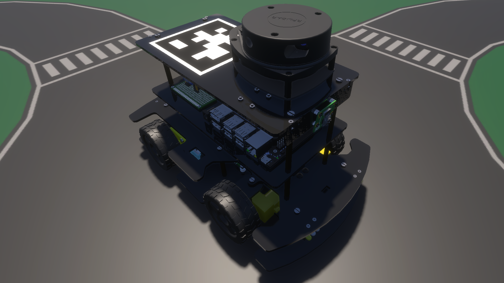 | 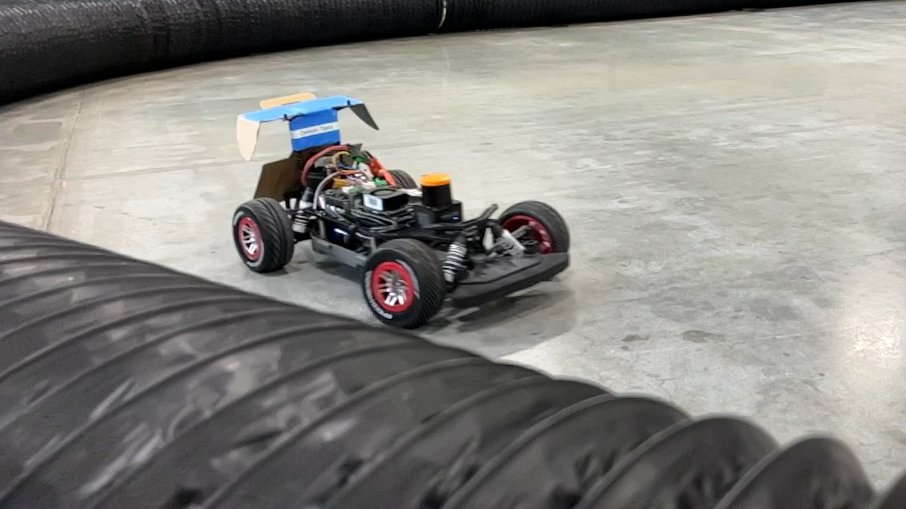 | 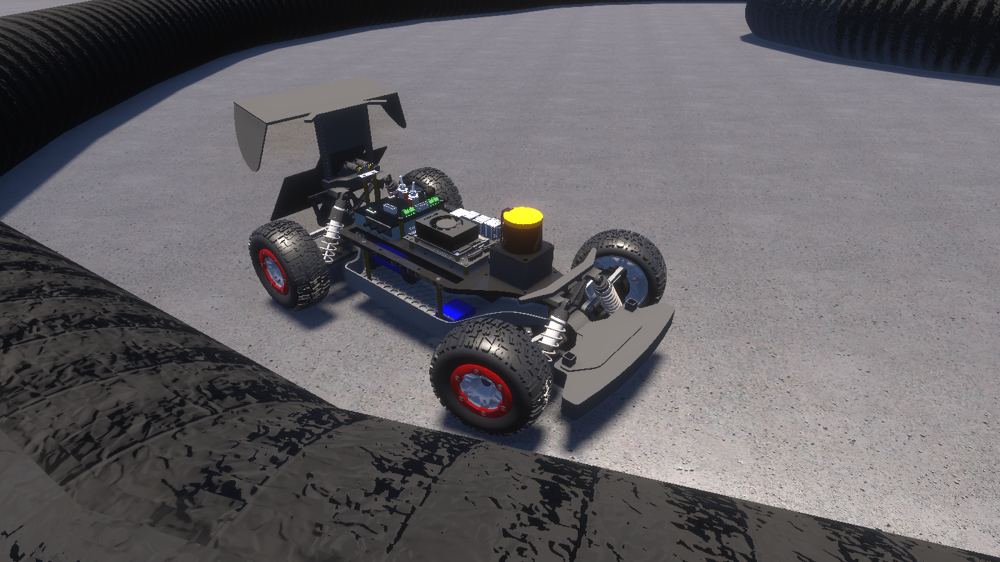 |
|:------------------:|:-----------------:|:--------------------:|:-------------------:|
| **Physical Nigel** | **Virtual Nigel** | **Physical F1TENTH** | **Virtual F1TENTH** |

<p align="justify">
We leveraged <a href="https://github.com/Tinker-Twins/AutoDRIVE/tree/AutoDRIVE-Simulator">AutoDRIVE Simulator</a> to develop physically and graphically realistic digital twin models of <a href="https://autodrive-ecosystem.github.io">Nigel</a> and <a href="https://f1tenth.org">F1TENTH</a>, two scaled autonomous vehicle platforms with unique qualities and capabilities. This process involved modeling, calibrating and simulating physically accurate vehicle dynamics, physics-based sensors and actuators as well as vehicle-environment interaction, while equally weighing the lighting and rendering aspects for photorealistic visual fidelity. The focus of this process was to train sim2real-worthy MARL policies by bridging the <i><b>real2sim</b></i> gap between simulation and reality.
</p>

| 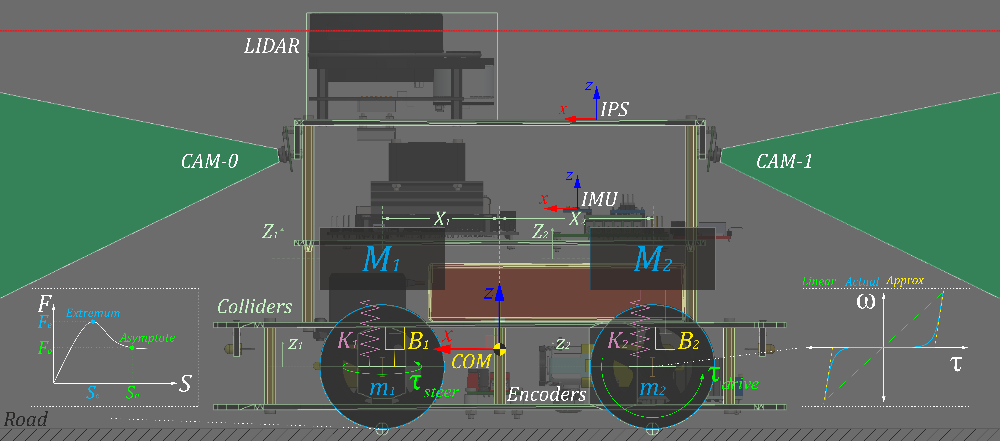 | 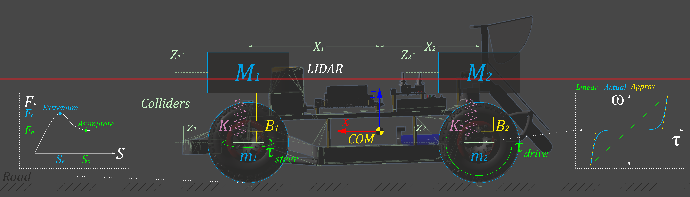 |
|:----------------------:|:------------------------:|
| **Nigel Digital Twin** | **F1TENTH Digital Twin** |

<p align="justify">
From MARL perspective, the said simulation framework was developed modularly using object-oriented programming (OOP) constructs. This allowed selectively scaling up/down the parallel agent/environment instances on demand. Additionally, the simulator took advantage of CPU multi-threading as well as GPU instancing (if available) to efficiently parallelize various simulation objects and processes, with cross-platform support.
</p>

## SIMULATION PARALLELIZATION

| 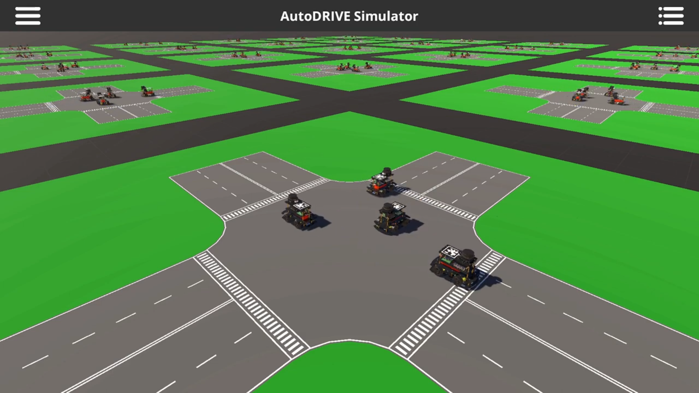 | 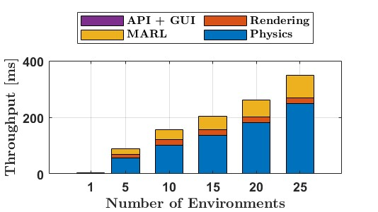 | 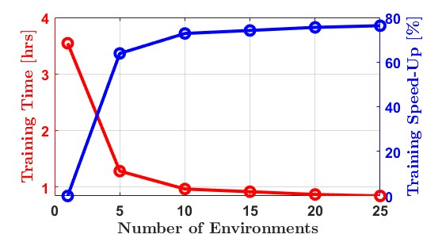 |  |
|:---------------------------------------:|:---------------------------------------:|:---------------------------------------:|:---------------------------------------:|
|  | 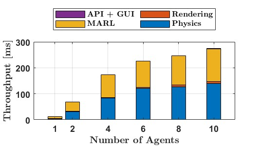 | 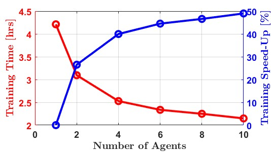 | 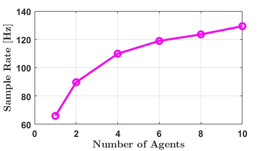 |

Following is an overview of the simulation parallelization schemes supported by AutoDRIVE Simulator:

- **Parallel Instances:** Multiple instances of the simulator application can be spun up to train families of multi-agent systems, each isolated within its own simulation instance. This is a brute-force parallelization technique, which can cause unnecessary computational overhead.
- **Parallel Environments:** Isolated agents can learn the same task in parallel environments, within the same simulation instance. This method can help train single/multiple agents in different environmental conditions, with slight variations in each environment.
- **Parallel Agents:** Parallel agents can learn the same task in the same environment, within the same simulation instance. The parallel agents may collide/perceive/interact with selective peers/opponents. Additionally, the parallel agents may or may not be exactly identical, thereby robustifying them against minor parametric variations.

<p align="justify">
Particularly, we adopted environment parallelization (1 to 25 parallel environments, with 4 agents each) for cooperative MARL and agent parallelization (1x2 to 10x2 adversarial agents) for competitive MARL.
</p>

<p align="justify">
We analyzed the effect of agent/environment parallelization on training MARL behaviors. As observed in both the rows, the reduction in training time was quite non-linear since the simulation workload increased with increasing parallelization. Additionally, it should be noted that parallelization beyond a certain point can hurt, wherein the increased simulation workload may slow down the training so much that parallel policy optimization can no longer accelerate it. This <i>"saturation point"</i> is dependent on the hardware/software configuration, and is subject to change.
</p>

## MARL FORMULATION

|  | 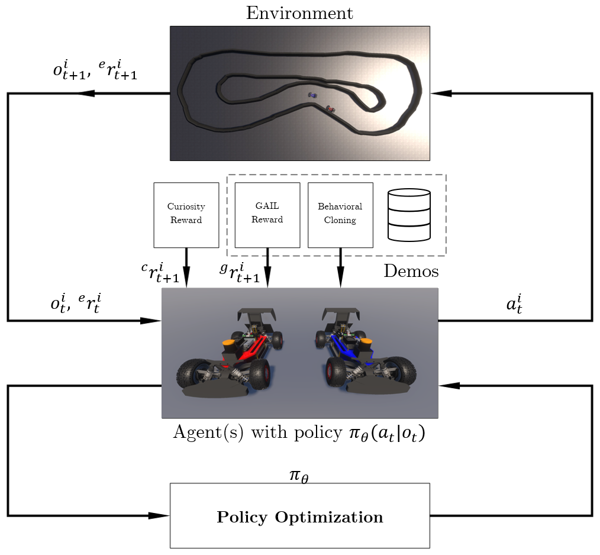 |
|:-----------------------------------------------------------------:|:--------------------------------------------------------------:|
| **Deep Reinforcement Learning Architecture for Cooperative MARL** | **Demonstration-Guided DRL Architecture for Competitive MARL** |

<p align="justify">
We formulated the cooperative MARL problem (left sub-figure) as a partially observable Markov decision process (POMDP) with limited state sharing among the agents via V2V communication. We adopted a deep reinforcement learning (DRL) architecture and crafted a novel reward function to train the agent(s) to traverse the 4-way intersection safely.
</p>

<p align="justify">
The competitive MARL problem (right sub-figure) was also formulated as a partially observable Markov decision process (POMDP), but without any state sharing among the agents. We adopted a hybrid imitation-reinforcement learning architecture and crafted a novel reward function to train a deep neural network policy to drive (using imitation learning) and race (using reinforcement learning) autonomously.
</p>

## MARL TRAINING

|  | 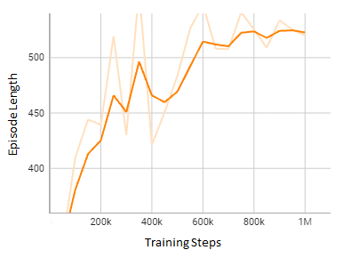 |  |
|:---------------------------------------:|:---------------------------------------:|:---------------------------------------:|
| 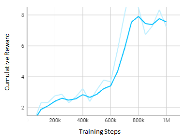 |  | 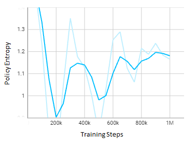 |

<p align="justify">
For cooperative MARL (top row), we analyzed the effect of both centralized training and decentralized execution (CTDE) or multi-agent PPO (MAPPO) as well as decentralized learning or independent PPO (IPPO) on training. The key training metrics being analyzed here were the cumulative reward, episode length and policy entropy. A general indication of “good” training is that the cumulative reward is maximized and then saturated, the episode length is adequate (longer duration implies agents wandering off in the environment, while very short duration may be indicative of agents colliding/overstepping lane bounds), and the policy entropy (i.e., randomness) has decreased steadily as the training progressed.
</p>

|  |  |  |
|:---------------------------------------:|:---------------------------------------:|:---------------------------------------:|
|  |  | 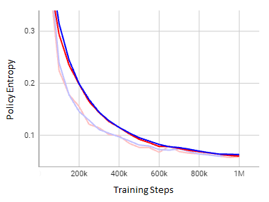 |

<p align="justify">
For competitive MARL (bottom row), the training phase of the proposed approach was analyzed in order to gain a better insight into the multi-agent PPO (MAPPO) process, and comment on the effectiveness of the hybrid learning strategy adopted therein. Particularly, we analyzed the imitation learning (behavioral cloning loss, GAIL reward) and reinforcement learning (curiosity reward, extrinsic reward) metrics along with the episode length and policy entropy.  A general indication of “good” training is that the behavioral cloning loss has decayed smoothly, the GAIL, curiosity and extrinsic rewards are maximized and then saturated, the episode length is adequate (longer duration implies agents driving slowly, while very short duration may be indicative of agents colliding without lap completion), and the policy entropy (i.e., randomness) has decreased steadily as the training progressed. It is to be noted that the non-zero offset in behavioral cloning loss indicates that the agents have not over-fit to the demonstrations; rather, they have explored the state space quite well to maximize the extrinsic reward by adopting aggressive “racing” behaviors.
</p>

## EMERGENT BEHAVIORS

| 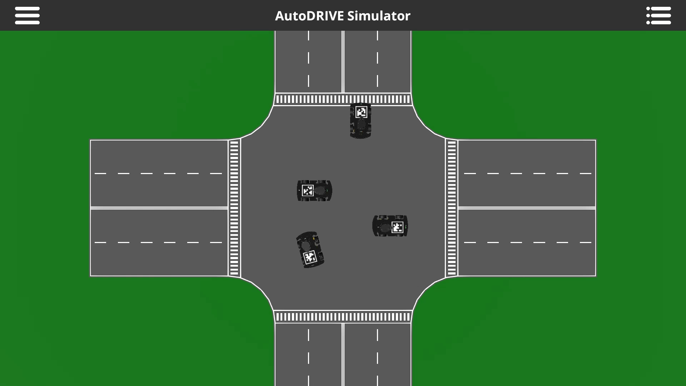 | 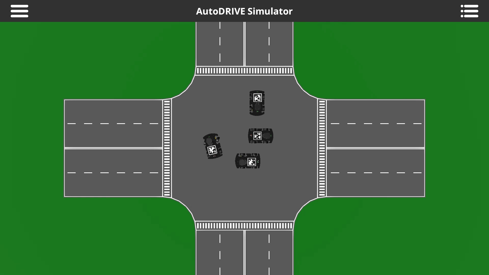 | 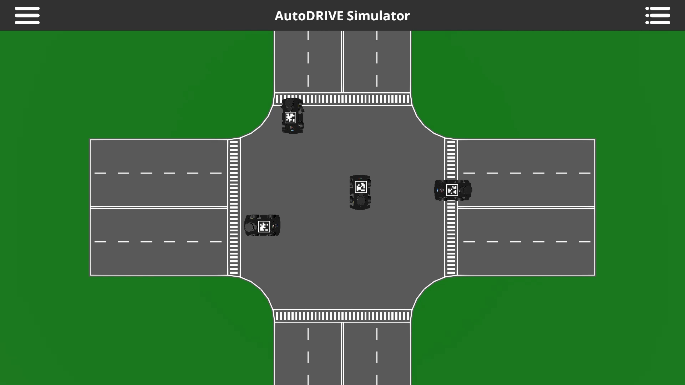 |
|:---------------------------------------:|:---------------------------------------:|:---------------------------------------:|
| 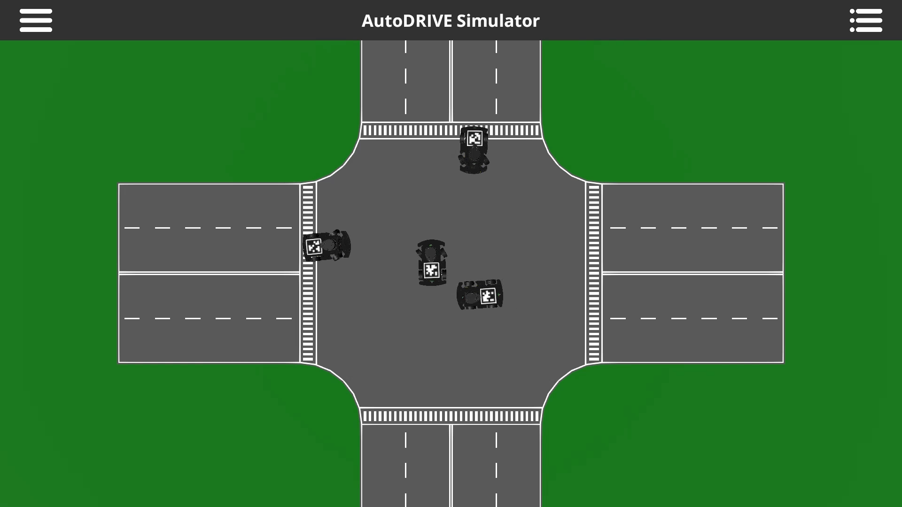 | 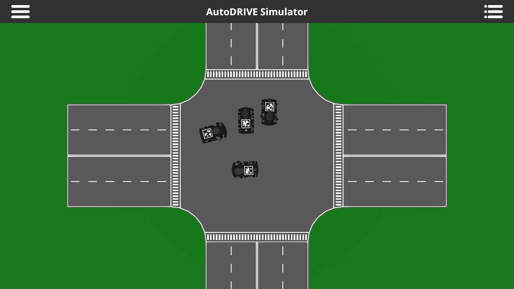 | 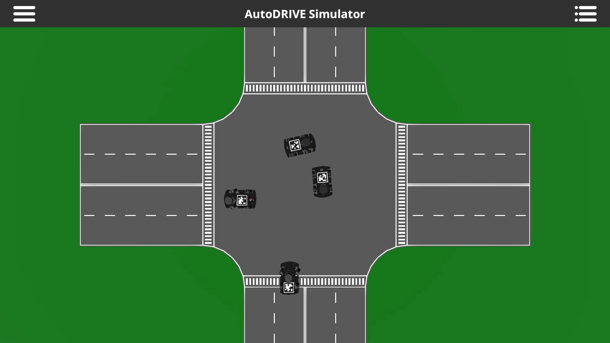 |

<p align="justify">
The trained policies for cooperative MARL were deployed onto the respective simulated vehicles. Figures in the first row present three key stages of the "throttle-priority" collision avoidance behavior, which primarily controls vehicle throttle to speed-up/slow-down agents to avoid collisions. The first stage depicts vehicles 1, 2, and 4 approaching the conflict zone with almost equivalent velocities, while vehicle 3 travels slowly. The second stage shows vehicle 1 executing a left turn, vehicles 3 and 4 slowing down, and vehicle 2 speeding up to avoid potential collision. Finally, the third stage illustrates vehicle 1 performing a subtle right turn to reach its goal, while vehicles 2 and 4 also reach their respective goals, and vehicle 3 continues driving slowly. Figures in the second row display three key stages of the "steering-priority" collision avoidance behavior. In the first frame, vehicles 1 and 4 successfully avoid collision. The second frame showcases vehicle 1 finding a gap between vehicles 2 and 3 to reach its goal. In the third frame, vehicles 2 and 3 evade collision, while vehicle 4 approaches its goal, and vehicle 1 is re-spawned.
</p>

| 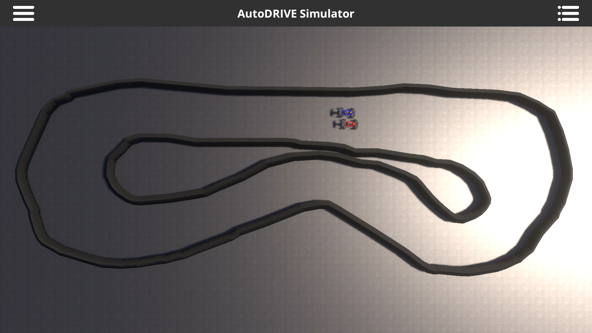 |  |  |
|:---------------------------------------:|:---------------------------------------:|:---------------------------------------:|
| 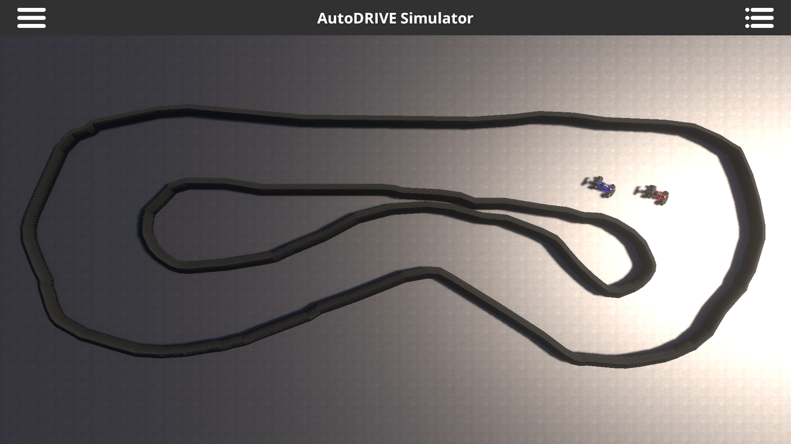 | 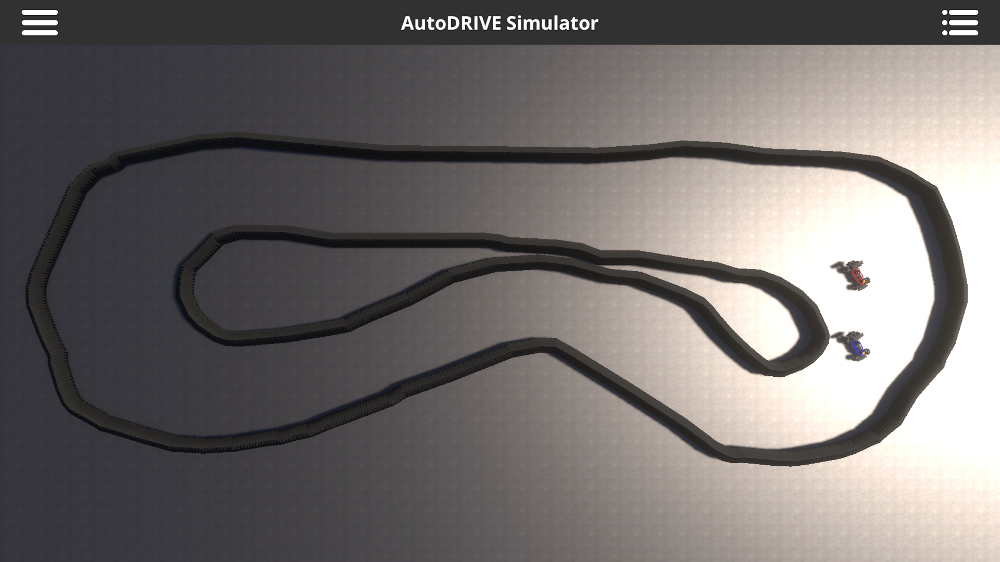 | 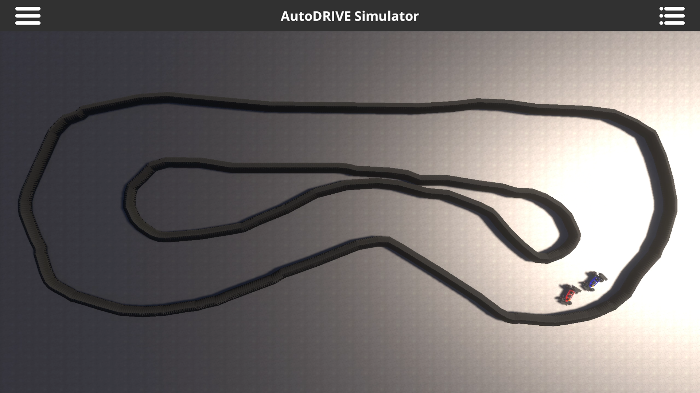 |

<p align="justify">
The trained policies for competitive MARL were deployed onto the respective simulated vehicles, which were made to race head-to-head on the same track with a phase-shifted initialization (as in real F1TENTH competitions). Apart from completing several laps, we noticed some clever strategies that the agents had learned to block/overtake their opponent. Figures in the first row present three snapshots of a <i>block-block-overtake sequence</i>, wherein the red agent kept blocking the blue agent throughout the straight, but the blue agent took a wider turn with higher velocity and took advantage of its under-steer characteristic to cut in front of the red agent and overtake it. Figures in the second row display three snapshots of a <i>let-pass-and-overtake</i> sequence, wherein the blue agent found a gap between the red agent and inside edge of the track and opportunistically overtook it. However, due to its under-steering characteristic, it went wider in the corner, thereby allowing the red agent to overtake it and re-claim the leading position.
</p>

## SIM2REAL TRANSFER

| 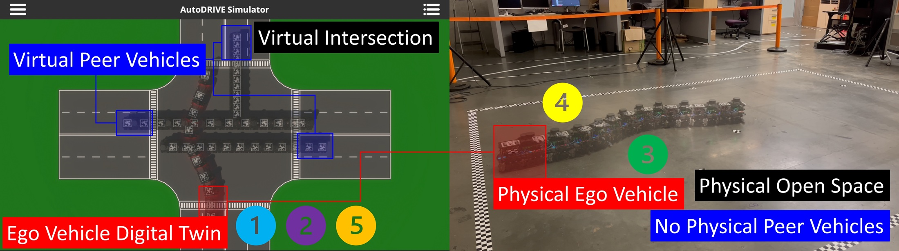 |
|:-----------------------------------------:|
| 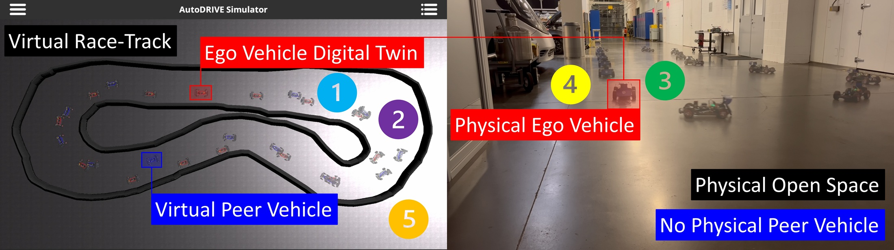 |

<p align="justify">
We propose a hybrid method for transferring the MARL policies from simulation to reality. The term <i>"hybrid"</i> specifically alludes to the mixed-reality digital twin (MRDT) framework, which establishes a real-time bi-directional synchronization between the physical and virtual worlds. The intention is to minimize the number of physical agent(s) and environmental element(s) while deploying and validating MARL systems in the real world. The above figures (captured at 1 Hz) depicts the <i><b>sim2real</b></i> transfer of the trained MARL policies using the MRDT framework while the figure below (captured at 5 Hz) depicts the possibility of optionally training/fine-tuning MARL policies (e.g., if there is a significant modification in the real-world setup such as the deliberately introduced turf mat in our case) within the same framework (thereby minimizing the experimental setup while enjoying the benefits of real-world data for policy update).
</p>

<p align="justify">
Here, we deploy a single physical agent in an open space and connect it with its digital twin. The "ego" digital twin operates in a virtual environment with virtual peers, collects observations, optimizes (optionally, during training/fine-tuning) and/or uses (during testing/inference) the MARL policy to plan actions in the digital space. The planned action sequences are relayed back to the physical twin to be executed in the real world, which updates its state in reality. Finally, the ego digital twin is updated based on real-time state estimates of its physical twin (estimated on board) to close the loop. This process is repeated recursively until the experiment is completed.
</p>

|  |
|:------------------------------------------:|

<p align="justify">
This way, we can exploit the real-world characteristics of vehicle dynamics and tire-road interactions while being resource-altruistic by augmenting environmental element(s) and peer agent(s) in the digital space. This also alleviates the safety concern of the experimental vehicles colliding with each other or the environmental element(s), especially as operational scales and number of agents increase.
</p>

## PERFORMANCE BENCHMARKS

| 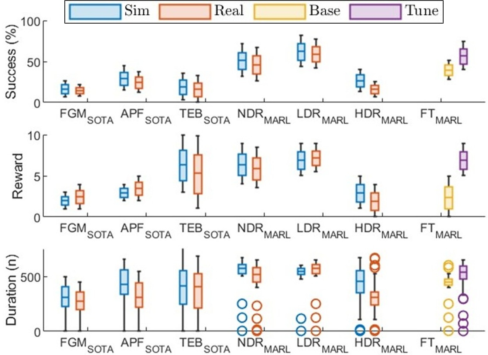 | 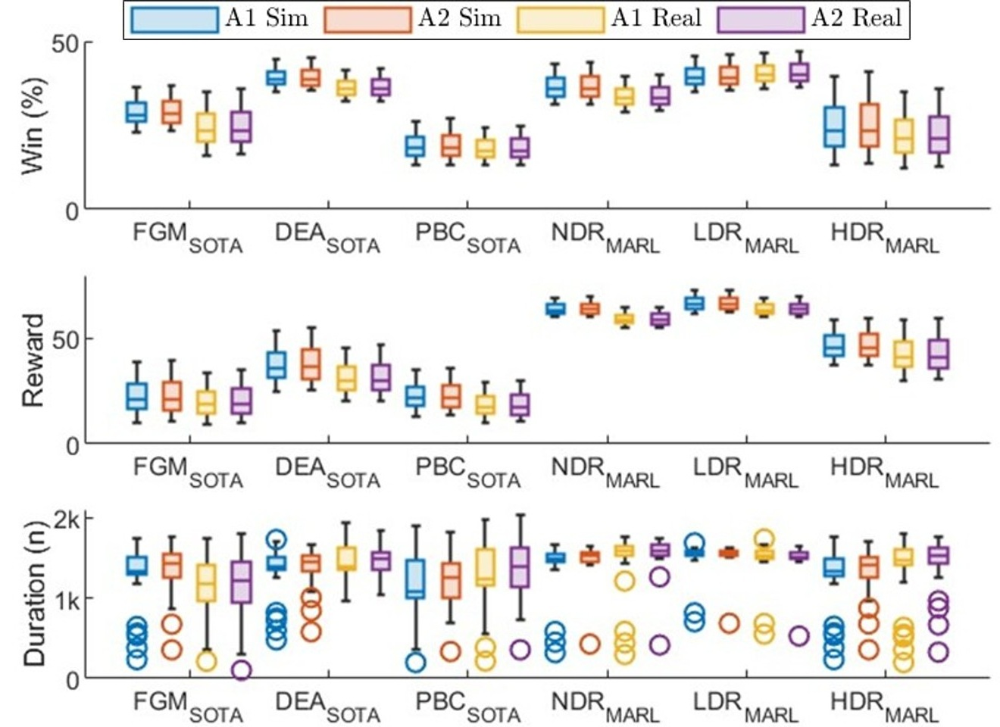 |
|:---------------------------------:|:---------------------------------:|
| **Cooperative MARL Benchmarking** | **Competitive MARL Benchmarking** |

<p align="justify">
We benchmark cooperative and competitive MARL policies trained with no (NDR), low (LDR) and high (HDR) domain randomization against 3 state-of-the-art (SOTA) baselines. First, we choose follow-the-gap method (FGM) as a common benchmark for both cooperative and competitive tasks. Additionally, we benchmark the cooperative MARL policies against artificial potential field (APF) method and timed-elastic-band (TEB) planner, which are common approaches for dynamic obstacle avoidance. Similarly, we also benchmark the competitive MARL policies against disparity-extender algorithm (DEA) and pure behavioral cloning (PBC), which are popular approaches in F1TENTH autonomous races. Finally, we also benchmark the performance of the best cooperative MARL policy before (base) and after fine-tuning (FT) in the real world to adapt to the deliberately introduced turf mat.
</p>

## SETUP

1. [Download](https://unity.com/download) and [install](https://docs.unity3d.com/hub/manual/InstallHub.html) Unity Hub along with Unity 2021.3.9f1 (LTS) or higher.

2. Install AutoDRIVE Simulator (from source):
     
    - Clone the `AutoDRIVE-Simulator` branch of the `AutoDRIVE` repository:
    
      ```bash
      $ git clone --single-branch --branch AutoDRIVE-Simulator https://github.com/Tinker-Twins/AutoDRIVE.git
      ```
    - Unzip source files larger than 100 MB:
      > ***Note:*** *You may delete the `*.zip` and `*.zip.meta` files after the unzipping operation.*

    - Launch Unity Hub and select `ADD` project button. Navigate to the download directory and select the parent folder of the `AutoDRIVE` repository.
  
    - Launch AutoDRIVE Simulator by running the project.
      > ***Note:*** *It may take several minutes to import and load the project for the first time. Please be patient.*
    
    - Bake lightmaps for larger scenes.
      > ***Note:*** *The lightmap baking process may take several minutes/hours depending upon the computational platform.*
  
    - For this project, we'll be working with the [Intersection School - Parallel MARL](https://github.com/Tinker-Twins/AutoDRIVE/blob/AutoDRIVE-Simulator/Assets/Scenes/Intersection%20School%20-%20Parallel%20MARL.zip) and [F1TENTH - Parallel MARL](https://github.com/Tinker-Twins/AutoDRIVE/blob/AutoDRIVE-Simulator/Assets/Scenes/F1TENTH%20-%20Parallel%20MARL.unity) scenes for training, and the [Intersection School - Digital Twin MARL](https://github.com/Tinker-Twins/AutoDRIVE/blob/AutoDRIVE-Simulator/Assets/Scenes/Intersection%20School%20-%20Digital%20Twin%20MARL.unity) and [F1TENTH - Digital Twin MARL](https://github.com/Tinker-Twins/AutoDRIVE/blob/AutoDRIVE-Simulator/Assets/Scenes/F1TENTH%20-%20Digital%20Twin%20MARL.unity) scenes for deployment. Ensure that you can open and run them.

3. Install ML-Agents Unity Package (tested version: `com.unity.ml-agents v2.0.1`):
   
    The Unity ML-Agents C# SDK is a Unity Package. You can install the `com.unity.ml-agents` package [directly from the Package Manager registry](https://docs.unity3d.com/Manual/upm-ui-install.html). Please make sure to enable 'Preview Packages' in the 'Advanced' dropdown in order to find the latest Preview release of the package.
   
    > ***Note:*** *AutoDRIVE Simulator comes pre-installed with `com.unity.ml-agents v2.0.1`. As such, this step should NOT be necessary. However, in case you face issues importing this Unity package, please consult the [official Unity ML-Agents installation guide](https://github.com/Unity-Technologies/ml-agents/blob/main/docs/Installation.md).*

4. Install ML-Agents Python Package (tested version: `mlagents 0.26.0`):

  - Create a virtual environment (strongly recommended):
	    
    ```bash
    $ conda create --name autodrive python=3.8
    ```
      
  - Activate the environment:
  
    ```bash
    $ conda activate autodrive
    ```

  - Install `mlagents` package from PyPi (this command also installs the required dependencies including PyTorch):
    
    ```bash
    $ python -m pip install mlagents==0.26.0
    ```

    > ***Note:*** *It is strongly recommended that you use packages from the same release together for the best experience. Please consult the [official Unity ML-Agents releases page](https://github.com/Unity-Technologies/ml-agents/releases) for better understanding the version compatibility of different packages.*

## USAGE

### Programming

Every `agent` needs a script inherited from the `Agent` class. This project contains two such `agent` scripts:
- [NigelCrossing](Agents/NigelCrossing.cs): For collaborative multi-agent intersection traversal.
- [F1TenthRacing](Agents/F1TenthRacing.cs): For competitive head-to-head autonomous racing.

For defining your own agents, you will first need to import the `Unity.MLAgents` namespace as follows:
```C#
using Unity.MLAgents;
using Unity.MLAgents.Sensors;
using Unity.MLAgents.Actuators;
```

Following are some useful methods from the `Agent` class:

1. `public override void Initialize()`

	Initializes the environment. Similar to `void Start()`.

2. `public override void CollectObservations(VectorSensor sensor)`

	Collects observations. Use `sensor.AddObservation(xyz)` to add observation "xyz".

3. `public override void OnActionReceived(ActionBuffers actions)`

	Map the actions from the `agent` to the actuations to be performed by the `actor` using the passed `actions`. You can choose a discrete action space using `actions.DiscreteActions[i]` or a continuous one using `actions.ContinuousActions[i]`. Reward function is also defined in this section using the `SetReward()` method. You can use `if`-`else` cases to define rewards/penalties. Finally, don't forget to call `EndEpisode()` to indicate end of episode.

	> ***Note:*** *It is to be noted that `agent` is an intelligent entity capable of making observations and taking decisions; it can “learn”. On the contrary, `actor` is a physical entity within the environment. It is controlled by an agent. In this context, the terms "agent" and "AI" can go together, much like interchangeably using the terms “actor” and “robot”.*

4. `public override void OnEpisodeBegin()`

	This method is called after `EndEpisode()`. Define your "reset" algorithm here before starting the next episode.

5. `public override void Heuristic(in ActionBuffers actionsOut)`

	Use `actionsOut.DiscreteActions[i]` or `actionsOut.ContinuousActions[i]` to define manual-override controls during `Heuristic Only` behaviour of the agent.

You will need to attach this `agent` script to the agent along with `BehaviourParameters` and `DecisionRequester` scripts inbuilt with the ML-Agents Unity Package (just search their names in `Add Component` dropdown menu of the agent gameobject). Optionally, you may also want to add `DemonstrationRecorder` script for imitation learning or demonstration-guided reinforcement learning. Finally, ML-Agents Unity Package also provides several sensor scripts such as `VectorSensor`, `GridSensor`, `CameraSensor`, `RenderTextureSensor`, `RayPerceptionSensor`, etc., which may come in handy.

### Debugging

After defining your logic, test the functionality by selecting `Heuristic Only` mode in the `Behaviour Type` of the `BehaviourParameters` script attached to the agent. You can manually control the agents to validate observation and action spaces, reward signals, resetting conditions, or complexity of the scenario/behavior in general.

### Training

1. Create a configuration file (`<config>.yaml`) to define training parameters. This project contains two such `config` files:
- [NigelCrossing](Training/Training%20Configurations/NigelCrossing.yaml): For collaborative multi-agent intersection traversal using deep reinforcement learning.
- [F1TenthRacing](Training/Training%20Configurations/F1TenthRacing.yaml): For competitive head-to-head autonomous racing using demonstration-guided deep reinforcement learning.
  > ***Note:*** *The pre-recorded sub-optimal single-agent driving demonstrations (5 laps) for both the agents are located in [Demonstrations](Training/Demonstrations) directory of this project.*

For creating your own training configurations, please refer to the [official training configuration guide](https://github.com/Unity-Technologies/ml-agents/blob/main/docs/Training-Configuration-File.md).

2. Within the `BehaviourParameters` script attached to the agent, give a unique `Behaviour Name` for training purpose. Also configure the observation and action spaces appropriately.
   > ***Note:*** *You must set the `Behavior Type` of all agents to `Default` in order to enable training. The agent(s) will not learn in `Heuristic Only` or `Inference Only` modes.*

3. At this point, you may set the `Decision Period` within the `DecisionRequester` script attached to the agent.

4. Launch an Anaconda Prompt and activate the virtual environment:
  
    ```bash
    $ conda activate autodrive
    ```

5. Navigate to the [Results](Results) directory:
   
   ```bash
    $ cd <path/to/Results>
    ```
   > ***Note:*** *The training results will be stored in this directory. However, you can move/organize them later to avoid overwriting.*

6. Start the training by sourcing the appropriate training configuration (using relative/global path) and `run-id`.
   
   ```bash
   $ mlagents-learn path/to/<config>.yaml --run-id=<Run1>
   ```

7. Hit the `Play` button in Unity Editor to "actually" start the training.

### Training Analysis

1. Navigate to the parent folder of [Results](Results) directory:
   
   ```bash
    $ cd <path/to/parent/folder/of/Results>
    ```

2. Launch TensorBoard to analyze the training results:
   
   ```
   $ tensorboard --logdir Results
   ```

3. Open a browser application (tested with Google Chrome) and log on to http://localhost:6006 to view the training results.

    > ***Note:*** *You can view the training results "live" as the training happens, or choose to view them after the training is complete.*

### Deployment

1. Navigate to the `Results` directory and locate a folder named after the `<training_behaviour_name>/<run-id>` that you defined while training the agent(s).

2. In the inspector window, attach the saved neural network models (the `*.onnx` files) to the respective `Model` variable in the `BehaviourParameters` script attached to the agent(s).

3. Select `Default` or `Inference Only` mode in the `Behaviour Type` of the `BehaviourParameters` attached to the agent(s).

4. Hit the play button in Unity Editor and watch your agent(s) in autonomous mode!

### Sim2Real Transfer

1. Install and verify base packages (drivers, bringups, etc.) on Nigel and F1TENTH.

2. Install the [ROS packages](Sim2Real/ROS%20API) provided in this repository on the respective vehicles.

    > ***Note:*** *You can use the [Python API](Sim2Real/Python%20API) for preliminary testing.*

3. Launch the `digital_twin.launch` file for the respective vehicle.

    ```bash
    $ roslaunch autodrive_nigel digital_twin.launch # For Nigel
    $ roslaunch autodrive_f1tenth digital_twin.launch # For F1TENTH
    ```

4. Launch AutoDRIVE Simulator executable:

    ```bash
    $ ./AutoDRIVE \Simulator.x86_64
    ```

5. Enter the `IP Address` and `Port Number` (default: 4567) of the vehicle's on-board computer within the AutoDRIVE Simulator. You can obtain the IP address using `ifconfig` command on Linux. The Port Number need not be changed unless it is occupied by some other process.

    > ***Note:*** *For digital twinning, the workstation running AutoDRIVE Simulator and the vehicle(s) running AutoDRIVE Devkit (ROS API) must be on a shared network and discoverable to each other. You can test this using the `ping` command on Linux.*

6. Hit the `Connect` button in AutoDRIVE Simulator to establish the bi-directional digital thread between simulation and reality.

## HELPFUL TIPS

1. Craft the reward function(s) carefully; agents can cheat a lot (a.k.a. reward hacking)!

2. Tune the training parameters in `<config>.yaml` file(s) for your own experiments.

3. As far as possible, duplicate the RL agents/environments for parallel (faster) training.

4. As far as possible, use a dedicated router with sufficient bandwidth for digital twinning.

5. Please be mindful of the physical setup (available area, driving conditions, signal strength, potential hazards, etc.) during digital twinning. :warning: **STAY SAFE!** :warning:

## CITATION

We encourage you to read and cite the following papers if you use any part of this repository for your research:

#### [Mixed-Reality Digital Twins: Leveraging the Physical and Virtual Worlds for Hybrid Sim2Real Transition of Multi-Agent Reinforcement Learning Policies](https://arxiv.org/abs/2403.10996)
```bibtex
@article{AutoDRIVE-MRDT-MARL-2025,
author={Samak, Chinmay and Samak, Tanmay and Krovi, Venkat},
journal={IEEE Robotics and Automation Letters}, 
title={Mixed-Reality Digital Twins: Leveraging the Physical and Virtual Worlds for Hybrid Sim2Real Transition of Multi-Agent Reinforcement Learning Policies}, 
year={2025},
volume={10},
number={9},
pages={9040-9047},
doi={10.1109/LRA.2025.3592085}
}
```
This work has been accepted in **IEEE Robotics and Automation Letters (RA-L).** The publication can be found on [IEEE Xplore](https://ieeexplore.ieee.org/document/11091473).

#### [Multi-Agent Deep Reinforcement Learning for Cooperative and Competitive Autonomous Vehicles using AutoDRIVE Ecosystem](https://arxiv.org/abs/2309.10007)
```bibtex
@eprint{AutoDRIVE-MARL-2023,
title = {Multi-Agent Deep Reinforcement Learning for Cooperative and Competitive Autonomous Vehicles using AutoDRIVE Ecosystem}, 
author = {Tanmay Vilas Samak and Chinmay Vilas Samak and Venkat Krovi},
year = {2023},
eprint = {2309.10007},
archivePrefix = {arXiv},
primaryClass = {cs.RO},
url = {https://arxiv.org/abs/2309.10007}
}
```
This work has been accepted as Multi-Agent Dynamic Games (MAD-Games) Workshop paper at **2023 IEEE/RSJ International Conference on Intelligent Robots and Systems (IROS).** The publication can be found on [MAD-Games Workshop Website](https://iros2023-madgames.f1tenth.org/papers/samak.pdf).
